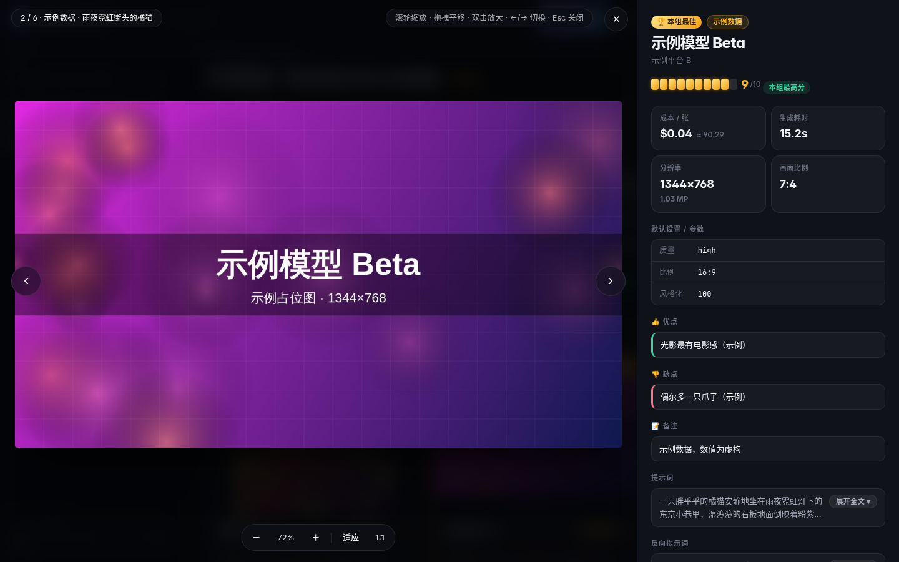
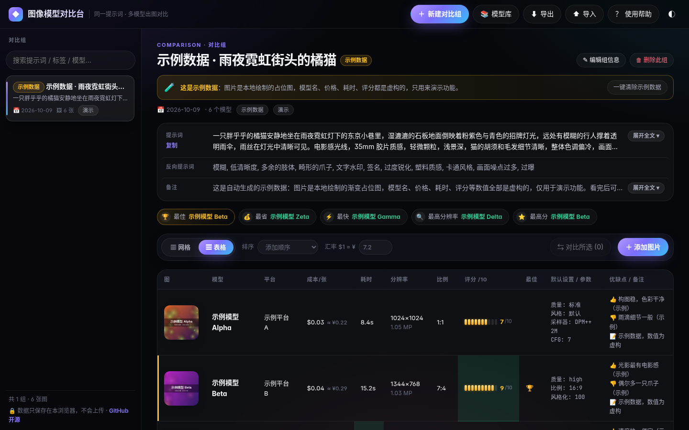
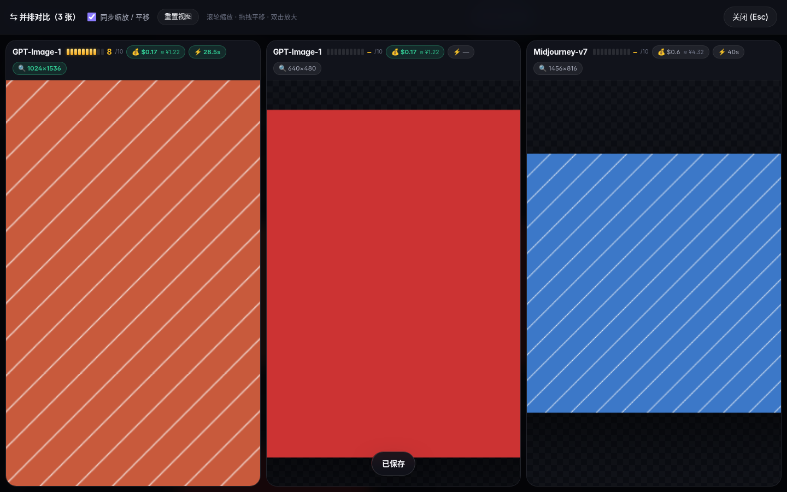
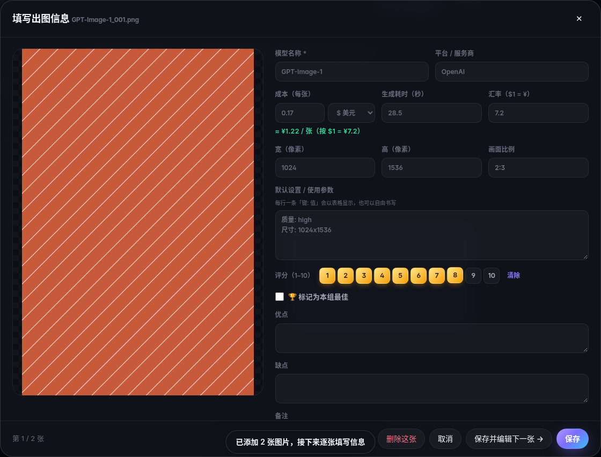
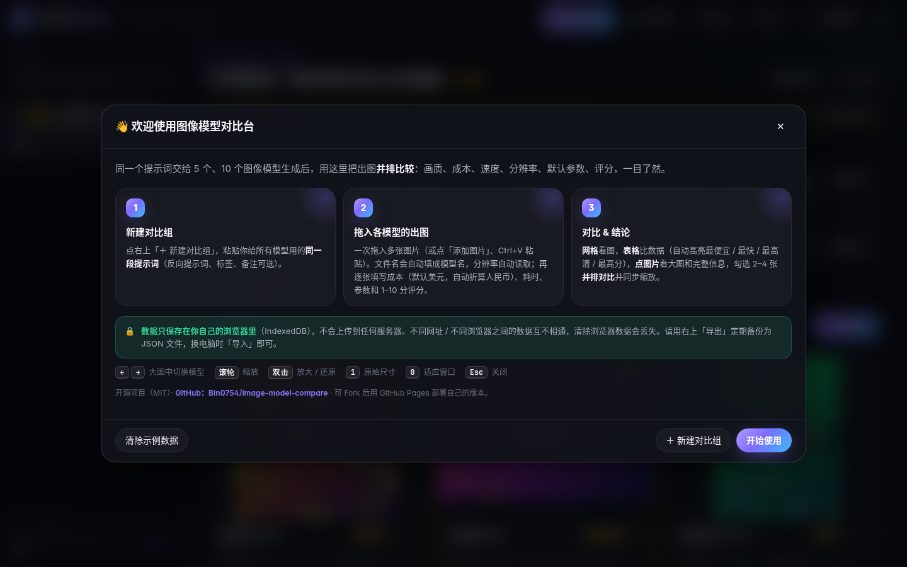

<div align="center">


# 图像模型对比台 · Image Model Compare

**同一个提示词，丢给 5 个、10 个 AI 图像模型——把出图并排摆在一起，画质、成本、速度、分辨率、参数一眼比完。**

[](https://bin0754.github.io/image-model-compare/)
[](https://github.com/Bin0754/image-model-compare/actions/workflows/test.yml)
[](LICENSE)


**👉 在线体验：<https://bin0754.github.io/image-model-compare/>**

[English](#english) · [功能](#-功能) · [快速开始](#-快速开始) · [部署你自己的版本](#-部署你自己的版本) · [使用说明](#-使用说明) · [数据与隐私](#-数据与隐私) · [常见问题](#-常见问题与限制) · [开发](#-开发)

</div>

---

## 📸 截图

| 网格视图：并排看图 + 关键指标 | 点开大图：左图右信息 |
|---|---|
|  |  |
| **表格视图：所有指标一张表，自动高亮最优** | **并排对比：2–4 张同步缩放** |
|  |  |
| **填写出图信息：美元自动折算人民币、10 分制评分** | **首次打开的使用帮助** |
|  |  |

提示词默认折叠成两行，点一下展开全文：


## ✨ 功能

- **按提示词分组**：一组 = 一段提示词（含反向提示词、日期、标签、备注），组内是各个模型的出图。
- **批量添加**：一次拖入多张图片 / 多选 / Ctrl+V 粘贴；**文件名自动识别为模型名**，分辨率与画面比例自动读取。
- **每张图的完整信息**：模型、平台、成本、生成耗时、分辨率、比例、默认设置 / 参数（`键: 值` 自动排成表格）、10 分制评分、优点、缺点、备注、「本组最佳」。
- **成本默认美元，自动折算人民币**：`$0.04 ≈ ¥0.29`，汇率可改（默认 7.2）；也支持 ¥ / 积分 / 其他。
- **四种视图**
  - **网格**：缩略图大小可调，可按成本 / 速度 / 评分 / 分辨率 / 模型名排序；
  - **表格**：全部指标一张表，自动高亮 💰最便宜、⚡最快、🔍分辨率最高、⭐评分最高；
  - **大图**：左侧大图（滚轮缩放、拖拽平移、双击放大、1:1 原尺寸），右侧完整信息面板，←/→ 切换模型；
  - **并排对比**：勾选 2–4 张同尺寸并排，可同步缩放 / 平移，看细节最方便。
- **模型库**：常用模型的平台、默认成本、默认参数记一次，之后自动填写。
- **导出 / 导入**：所有数据（含图片）导出成一个 JSON 文件，换电脑导入即可。
- **零依赖、纯前端**：一个 `index.html`，不需要服务器、不需要安装、不联网也能用；深色 / 浅色主题，手机也能看。

## 🚀 快速开始

### ① 直接用在线版

打开 <https://bin0754.github.io/image-model-compare/> 就能用。图片和数据只保存在你自己的浏览器里，**不会上传**到任何地方（见[数据与隐私](#-数据与隐私)）。

### ② 下载到本地，双击打开

1. 点本页右上角绿色的 **Code → Download ZIP**（或 `git clone https://github.com/Bin0754/image-model-compare.git`）；
2. 解压后**双击 `index.html`**，用 Chrome / Edge / Firefox 打开即可。

> 只需要 `index.html` 这一个文件就能运行，可以单独拷走。

### ③ 部署你自己的版本

见下一节。

## 🌐 部署你自己的版本

### 方式 A：Fork + GitHub Pages（推荐，免费）

1. 登录 GitHub，点本仓库右上角的 **Fork**，复制一份到你的账号下；
2. 进入你 Fork 出来的仓库 → **Settings** → 左侧 **Pages**；
3. **Build and deployment** 里，Source 选 **Deploy from a branch**；Branch 选 **`main`**，目录选 **`/ (root)`**，点 **Save**；
4. 等 1–2 分钟，页面顶部会出现网址：`https://<你的用户名>.github.io/image-model-compare/`，打开即可使用；
5. 以后想更新到最新版：在你的仓库页面点 **Sync fork → Update branch**。

> 仓库根目录已带 `.nojekyll`，GitHub Pages 会原样发布静态文件。

### 方式 B：Vercel / Netlify / Cloudflare Pages / 任意静态托管

这是一个纯静态网页，**没有构建步骤**：

- **Netlify**：打开 <https://app.netlify.com/drop>，把整个文件夹（或只把 `index.html`）**拖进去**就上线了；
- **Vercel**：New Project → 导入你的 Fork，Framework 选 **Other**，Build Command 留空，Output Directory 填 `.`；
- **Cloudflare Pages**：连接仓库，构建命令留空，输出目录 `/`；
- 也可以放到任何能托管静态文件的地方（Nginx、对象存储、内网共享盘……）。

> ⚠️ 不同网址 = 不同的浏览器存储空间。从在线 demo 换到你自己部署的网址时，请先在旧网址「导出」，再到新网址「导入」。

## 📖 使用说明

1. **新建对比组**：右上「＋ 新建对比组」，粘贴你给所有模型用的同一段提示词（反向提示词、日期、标签、备注可选）。保存后会直接弹出选图窗口。
2. **添加图片**：多选，或把多张图片直接拖进页面（也可 Ctrl+V 粘贴）。
   - 文件名会预填为模型名：`GPT-Image-1_001.png` → `GPT-Image-1`；如果文件名里包含模型库中已有的模型名，会自动匹配并带出默认值。
   - 分辨率、画面比例自动读取，也可手动修改。
3. **填写信息**：每张图逐个弹出表单——平台、成本、耗时、默认设置 / 参数（每行一条 `键: 值`）、评分、优点、缺点、备注、是否最佳。点「保存并编辑下一张」可连续填完一组。
4. **评分（10 分制）**：点 1–10 的数字方块即可，「清除」取消；网格、表格、大图里都以 10 格评分条显示，「最高分」自动高亮。
5. **成本与汇率**：成本默认单位是美元。输入美元价格时表单里实时显示人民币折算，网格 / 表格 / 大图里也都显示 `≈ ¥`。汇率在工具栏或表单里修改（默认 `$1 = ¥7.2`，全局生效）。积分 / 其他单位不参与「最便宜」比较。
6. **查看与对比**
   - **网格 / 表格**切换在工具栏；排序在「排序」下拉或点表头；
   - **点任意图片**进入大图：滚轮缩放、拖拽平移、双击放大，`←` `→` 切换同组模型，`1` 原始尺寸，`0` 适应窗口，`Esc` 关闭；
   - **并排对比**：鼠标移到图片上，勾选左上角「对比」（2–4 张）→ 工具栏「对比所选」。
7. **提示词折叠**：组页面和大图信息面板里的提示词默认折叠，点「展开全文」或直接点文字展开，「收起」折叠。
8. **模型库**：表单里勾选「保存到模型库」，或在「📚 模型库」里手动添加 / 编辑。
9. **导出 / 导入**：「⬇ 导出」生成 `图像模型对比_备份_日期.json`（图片以 base64 内嵌）；「⬆ 导入」为**合并导入**，相同记录会被覆盖。旧版（5 星制）导出的文件也能导入，评分自动 ×2。
10. **示例数据**：首次打开会带一组「示例数据」（占位图 + 虚构数值），点横幅上的「一键清除示例数据」即可删除；想再看可在「使用帮助」里重新加载。

## 🔒 数据与隐私

- **所有数据只保存在你自己的浏览器里**（IndexedDB，图片以二进制 Blob 存储），**不会上传**到任何服务器；网页本身也不加载任何第三方脚本、字体或统计代码。
- 存储**按网址（origin）隔离**：`https://bin0754.github.io`、你自己部署的网址、本地双击打开的 `file://`，各自是**独立的数据**，互不相通；不同浏览器之间也不相通。
- 清除浏览器的网站数据、使用无痕模式，都会导致数据丢失或看不到。
- **请定期「导出」备份**；换电脑 / 换浏览器 / 换网址时，用「导出 → 导入」迁移。
- 导出的 JSON 里包含你的图片，请自行妥善保管（`.gitignore` 已默认忽略备份文件）。

## ❓ 常见问题与限制

- **能存多少图？** 取决于浏览器的存储配额（通常是磁盘剩余空间的一定比例，一般可存数 GB）。图片很多时，导出的 JSON 也会很大（base64 比原图大约 33%）。
- **为什么换了个地址打开，数据没了？** 浏览器按网址隔离存储。用旧地址导出、新地址导入即可。把 `index.html` 挪到别的文件夹后双击，在部分浏览器里也算新地址。
- **汇率会自动更新吗？** 不会，需要手动填写（默认 7.2）。
- **「最佳」能选多张吗？** 每组只能有一张，选新的会自动取消旧的。
- **支持哪些浏览器？** 新版 Chrome / Edge / Firefox / Safari。毛玻璃效果需要较新的浏览器，老浏览器会自动退化为普通半透明背景。Safari 未经过自动化测试。
- **能多人协作 / 云同步吗？** 目前不支持，这是一个纯本地工具；可以通过导出文件共享。
- **图片会被压缩吗？** 不会，原图原样保存，可在大图里「下载原图」。

## 🗂 项目结构

```
image-model-compare/
├── index.html              # ← 构建产物：单文件应用（直接双击 / Pages 发布的就是它）
├── src/                    # 源码（修改这里，然后运行 build.py）
│   ├── head.html           #   HTML 骨架、meta / Open Graph、头部与侧栏
│   ├── style.css           #   样式（深色 / 浅色主题）
│   ├── app1.js             #   工具函数、IndexedDB、状态、渲染（侧栏 / 网格 / 表格）
│   ├── app2.js             #   对比组表单、添加图片、出图信息表单、缩放组件
│   ├── app3.js             #   大图、并排对比、模型库、导出导入、数据迁移、示例数据、帮助、启动
│   └── build.py            #   合并 src/ → index.html（--check 校验是否同步）
├── tests/
│   ├── test_app.py         # 端到端测试（Playwright + headless Chromium，file://）
│   └── fixtures/v1-export.json  # 旧版（5 星制）导出文件，用于测试迁移
├── docs/
│   ├── screenshots/        # README 截图（由测试自动生成）
│   └── og-image.png        # 分享卡片图
├── .github/workflows/test.yml   # CI：每次 push / PR 自动跑测试
├── .nojekyll               # 让 GitHub Pages 原样发布
└── LICENSE                 # MIT
```

## 🛠 开发

不需要 Node / npm，只要 Python 3（构建与测试）和一个浏览器。

```bash
# 1. 修改 src/ 下的文件后，重新生成 index.html
python3 src/build.py

# 2. 检查 index.html 是否与 src/ 同步（CI 也会检查）
python3 src/build.py --check

# 3. 运行端到端测试（首次需要安装 Playwright 与 Chromium）
pip install playwright
python -m playwright install chromium     # Linux 上可加 --with-deps 安装系统依赖
python3 tests/test_app.py
```

- 测试会通过 `file://` 打开 `index.html`，覆盖：示例数据、欢迎帮助、提示词折叠、网格 / 表格 / 大图 / 并排对比、10 分评分、美元→人民币折算、新建组、上传与拖拽、模型库自动填充、导出 / 导入、旧数据迁移、清除示例数据等，并要求**没有任何控制台错误**。
- 测试默认把截图写到 `docs/screenshots/`（并生成 `docs/og-image.png`）；设置环境变量 `SHOT_DIR=/某个目录` 可改写输出位置（CI 就是这样做的，截图作为 artifact 上传）。
- **请提交构建后的 `index.html`**——GitHub Pages 直接发布仓库根目录，没有构建步骤。
- 数据结构有版本号（当前 v2）。改动存储结构时，请在 `src/app3.js` 的 `migrateEntry / migrateDB` 里加迁移逻辑，并在测试里覆盖。

## 📄 许可证

[MIT](LICENSE) © 2026 Bin0754

---

<a id="english"></a>

## English

**Image Model Compare** is a zero-dependency, single-file web app for comparing the outputs of multiple AI image-generation models given the **same prompt**.

- **Live demo:** <https://bin0754.github.io/image-model-compare/> (UI is in Simplified Chinese)
- **Features:** group outputs by prompt; drag-and-drop many images at once (file name → model name, resolution auto-detected); record provider, cost (USD by default, with live RMB conversion at an editable rate), generation time, resolution, aspect ratio, default settings, a **1–10 score**, pros/cons/notes and a "best" flag; grid view, table view with best-value highlighting, a lightbox with zoom/pan and a full info panel, and a synced side-by-side compare mode for 2–4 images; a model library for auto-filling defaults; JSON export/import with embedded images.
- **Privacy:** everything is stored **locally in your browser (IndexedDB)**. Nothing is uploaded and no third-party scripts are loaded. Storage is per-origin, so use Export/Import to move data between sites, browsers or machines.
- **Run locally:** download the repo and double-click `index.html`. No server or build step needed.
- **Deploy your own:** fork the repo → *Settings → Pages* → *Deploy from a branch*, `main` / `(root)` → Save. Or drag the folder into Netlify Drop, or import it into Vercel / Cloudflare Pages with an empty build command.
- **Develop:** edit files in `src/`, run `python3 src/build.py`, and test with `pip install playwright && python -m playwright install chromium && python3 tests/test_app.py`.
- **License:** MIT © 2026 Bin0754
